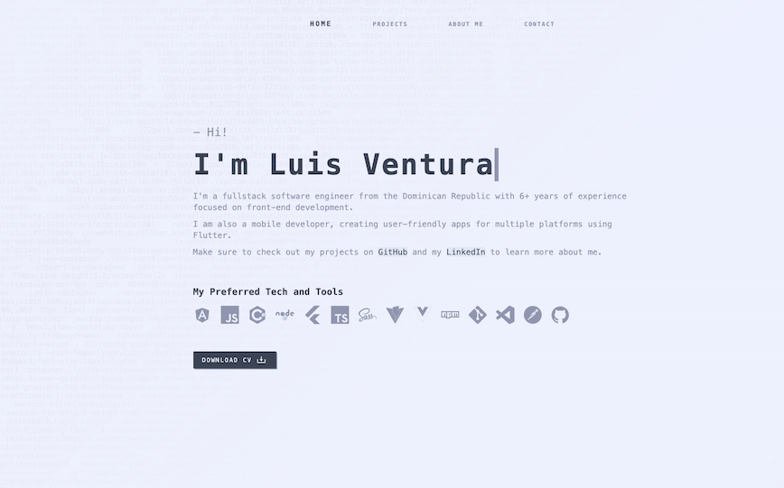
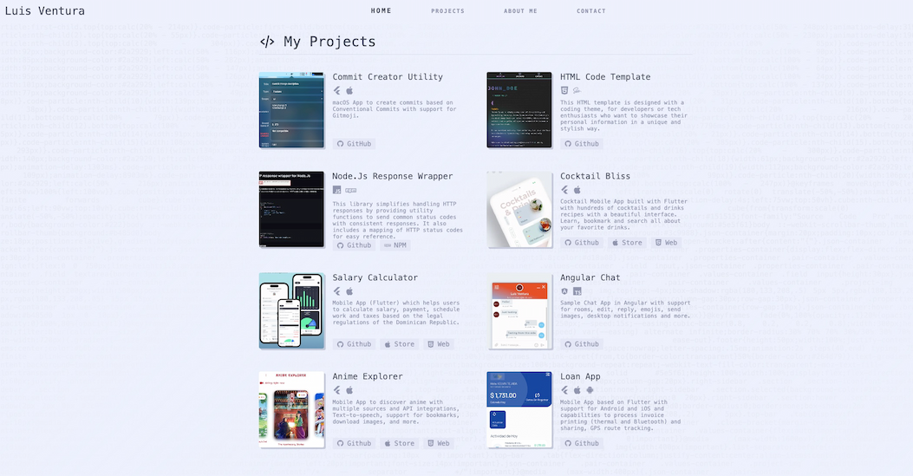
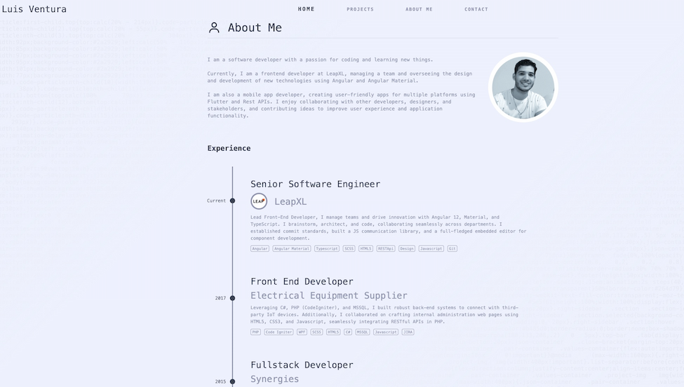

# Portfolio Template

This template is designed with a coding theme, for tech enthusiasts who want to showcase their personal projects.

### Preview

[Live Demo](https://luisvent.com)

### Desktop




### Tech

Build with SCSS and Vite

### Installation

``` sh
npm install
```

``` sh
npm run build
```

``` sh
copy html and css from dist folder
```

### Credits

- Tech icons: devicon.dev
- Icons: Boxicons

### License

### FREE TO USE WITH CREDITS

Portfolio Template © 2024 by Luis Ventura is licensed under CC BY 4.0

### About the Author

This template was created by Luis Ventura. Connect with me on [GitHub](https://github.com/luisvent) and [LinkedIn](https://www.linkedin.com/in/luisvent/) to learn more about my projects and professional background.
